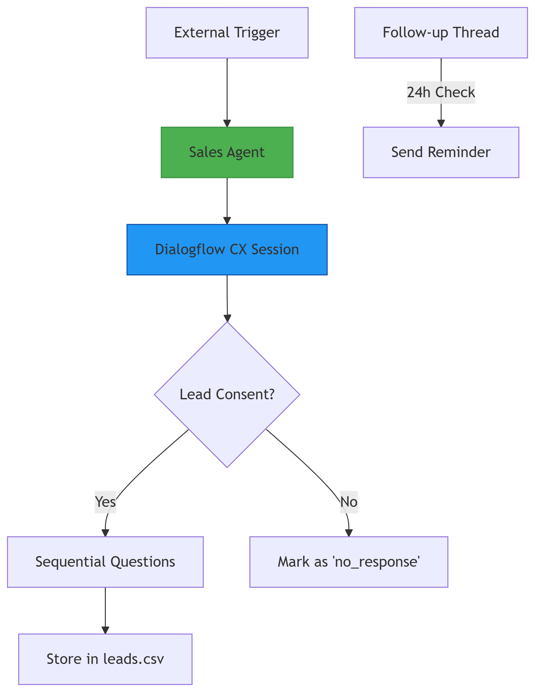

# Conversational Sales Agent with Threaded Processing


<p align="center">
  
</p>

A professional, multi-threaded Python sales agent that simulates concurrent lead conversations, automates follow-ups, and persists lead data using CSV. The interface leverages the `rich` library for an engaging, readable terminal UI.

🎬 **Demo:** [Tella Video Walkthrough](https://www.tella.tv/video/sales-agent-1-cpdm)

---

## 🚀 Features

- Multi-threaded lead processing (5+ concurrent conversations)
- Modern terminal UI with the `rich` library
- Automated follow-up system (e.g., 24-hour reminders)
- CSV-based persistent lead storage
- Thread-safe operations with resource locks

---

## 📁 Project Structure

```
sales-agent/
├── agent.py               # Core lead interaction logic
├── followup_manager.py    # Automated follow-up system
├── main.py                # Entry point and thread orchestration
├── trigger_simulator.py   # Lead simulation for testing
├── leads.csv              # Persistent storage of leads
├── requirements.txt       # Required Python packages
└── README.md              # Project documentation
```

---

## ⚙️ Installation

```bash
git clone https://github.com/AmaedaQ/sales-agent.git
cd sales-agent
python -m venv venv

# On Windows:
venv\Scripts\activate

# On macOS/Linux:
source venv/bin/activate

pip install -r requirements.txt
```

---

## 🧪 Running the Application

### Basic Usage

```bash
python main.py
```
- Launches 5 concurrent lead conversations
- Enables background follow-up checks
- Saves all interactions to `leads.csv`

### Advanced Options

```bash
python main.py --leads 10                  # Simulate 10 leads
python followup_manager.py --test-mode     # Run follow-up test mode (faster delay)
python trigger_simulator.py --count 3      # Simulate 3 leads only (no processing)
```

---

## 🔍 Key Modules

| Module                 | Purpose                           | Concepts                |
|------------------------|-----------------------------------|-------------------------|
| `agent.py`             | Conversational logic & data input | `rich`, CSV handling    |
| `followup_manager.py`  | Follow-up system and scheduler    | `threading`, `datetime` |
| `main.py`              | Thread orchestration and logging  | `threading`, `queue`    |
| `trigger_simulator.py` | Simulated lead generation         | CLI, randomness         |

---

## 📊 Sample CSV

```csv
lead_id,name,age,country,interest,status
1001,Alice,29,Canada,CRM Tools,secured
1002,,,,,no_response
```

---

## ✅ Testing Checklist

- **High-Concurrency Simulation**
  ```bash
  python main.py --leads 20
  ```
- **Follow-up Simulation (Fast Test Delay)**
  ```bash
  python followup_manager.py --test-delay 5
  ```
- **CSV Integrity Check**
  ```bash
  python -c "import csv; print(len(list(csv.reader(open('leads.csv')))))"
  ```

---

## 💡 Design Decisions

- **Threading over Async:** Favoring real multithreading for CPU and I/O parallelism
- **Rich Terminal UI:** Enhanced UX with color and formatting
- **CSV as Data Store:** Simple, portable, and tool-friendly
- **Background Follow-ups:** Daemon thread tracks elapsed time for reminders

---

## 📜 License

Licensed under the [MIT License](LICENSE).
